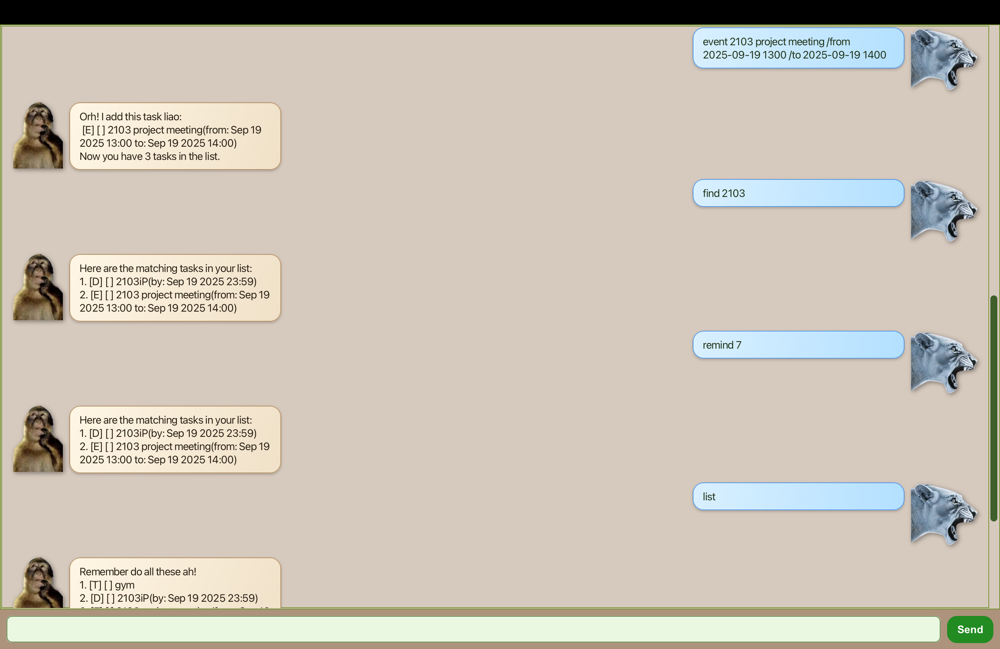

# Denz User Guide

Denz is a simple chatbot that helps you manage your tasks efficiently.  
It comes with both:
- A **Command Line Interface (CLI)**, for quick command-based usage.
- A **Graphical User Interface (GUI)** built with JavaFX, for a more user-friendly experience.

It supports todos, deadlines, events, reminders, and more.  
Your tasks are automatically saved between sessions, so you never lose them.

---

## Quick Start

1. Ensure you have **Java 11 or above** installed on your computer.
2. Download the latest `denz.jar` from the [Releases] page of this repository.
3. Copy the JAR file into an empty folder.
4. Open a command window in that folder.
5. Run the program with: java -jar denz.jar
6. Start typing commands to manage your tasks!

---

## Features

### Add a ToDo: `todo`

Adds a simple task without date/time.

**Format**:  
todo DESCRIPTION

**Expected Output**:  
Orh! I added this task liao:
[T][ ] read book
Now you have 1 tasks in the list.

---

### Add a Deadline: `deadline`

Adds a task with a due date and time.

**Format**:  
deadline DESCRIPTION /by yyyy-MM-dd HH:mm

**Example**:  
deadline submit report /by 2025-09-30 2359

**Expected Output**:  
Orh! I added this task liao:
[D][ ] submit report(by: Sep 30 2025 23:59)
Now you have 2 tasks in the list

---

### Add an Event: `event`

Adds a task with a start and end time.

**Format**:  
event DESCRIPTION /from yyyy-MM-dd HH:mm /to yyyy-MM-dd HH:mm

**Example**:  
event project meeting /from 2025-09-20 1400 /to 2025-09-20 1600

**Expected Output**:  
Orh! I added this task liao:
[E][ ] project meeting(from Sep 20 2025 14:00 to: Sep 20 2025 16:00)
Now you have 3 tasks in the list

---

### List All Tasks: `list`

Shows all tasks in your list.

**Format**:  
list

**Example**:  
list

**Expected Output**:  
Remember to do all these ah!
1.	[T][ ] read book
2.	[D][ ] submit report (by: 2025-09-30 23:59)
3.	[E][ ] project meeting (from: 2025-09-20 14:00 to: 2025-09-20 16:00)

---

### Mark a Task: `mark`

Marks a task as done.

**Format**:  
mark INDEX

**Example**:  
mark 1

**Expected Output**:  
Wah! Sui I have successfully marked this task as done liao:
[T][X] read book

---

### Unmark a Task: `unmark`

Unmarks a task (set it back to not done).

**Format**:  
unmark INDEX

**Example**:  
unmark 1

**Expected Output**:  
Walao, then you mark just now for what. Ok lah done, unmark this task liao:
[T][ ] read book

---

### Delete a Task: `delete`

Deletes a task from the list.

**Format**:  
delete INDEX

**Example**:  
delete 2

**Expected Output**:  
Walao eh! You sure ah, i have removed this task:
[D][ ] submit report (by: 2025-09-30 23:59)
Now you have 2 tasks in the list.

---

### Find Tasks: `find`

Finds tasks that contain a keyword.

**Format**:  
find KEYWORD

**Example**:  
find read

**Expected Output**:  
Here are the matching tasks in your list:
1.	[T][ ] read book

---

### Remind Tasks: `remind`

Lists tasks that are due or starting within the given number of days from today.

**Format**:  
remind DAYS

**Example**:  
remind 7

**Expected Output**:  
Here are the tasks within the next 7 days:
1.	[D][ ] submit report (by: 2025-09-30 23:59)
2.	[E][ ] project meeting (from: 2025-09-20 14:00 to: 2025-09-20 16:00)

OR

You lazy bum, you have nothing coming up in the next 7 days (if no task found)

---

### Exit the Program: `bye`

Exits Denz. Your tasks are saved automatically.

**Format**:  
bye

---

## Saving Data

- Denz automatically saves tasks after each change.
- Tasks are stored in `data/denz.txt` in the same folder as the JAR file.
- When you restart the program, tasks are loaded back from this file.

---

## Command Summary

| Command   | Format                                                                 |
|-----------|------------------------------------------------------------------------|
| **todo** | `todo DESCRIPTION`                                                     |
| **deadline** | `deadline DESCRIPTION /by yyyy-MM-dd HH:mm`                        |
| **event** | `event DESCRIPTION /from yyyy-MM-dd HH:mm /to yyyy-MM-dd HH:mm`       |
| **list** | `list`                                                                 |
| **mark** | `mark INDEX`                                                           |
| **unmark** | `unmark INDEX`                                                       |
| **delete** | `delete INDEX`                                                       |
| **find** | `find KEYWORD`                                                         |
| **remind** | `remind DAYS`                                                        |
| **bye** | `bye`                                                                   |

---

## FAQ

**Q: What happens if I enter an invalid index?**  
A: Denz will show you an error message like `invalid task number!!`.

**Q: What happens if I mark a task that’s already done?**  
A: Denz will warn you: `the task is already completed!`.
